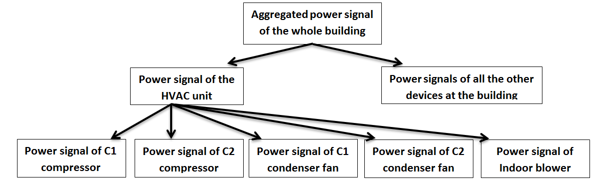
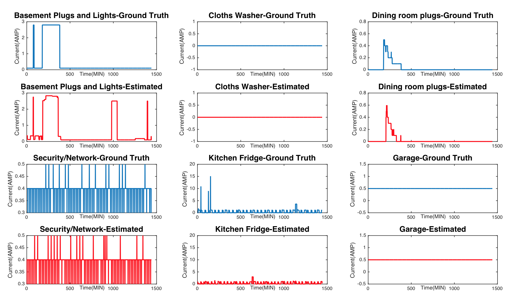
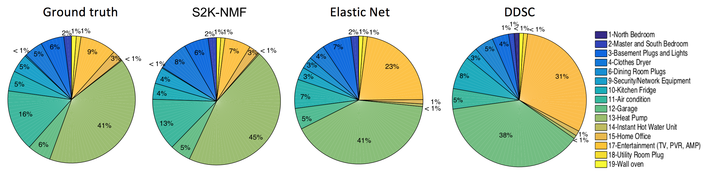
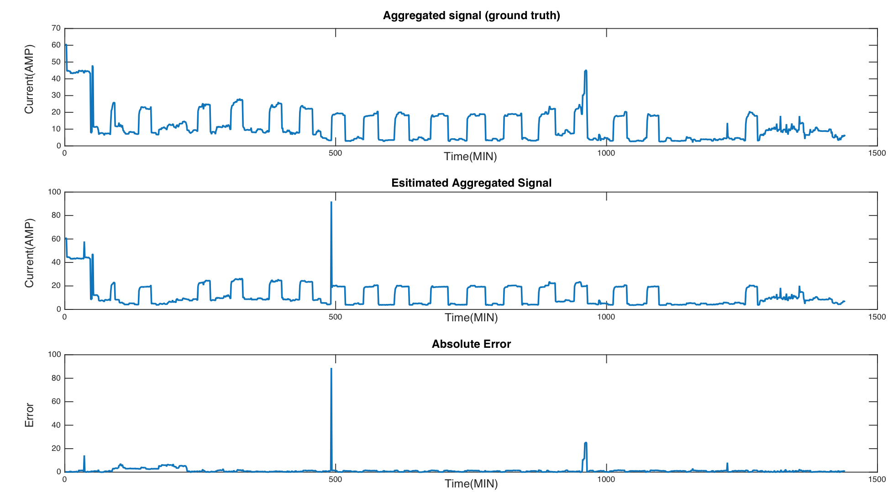

# Non-Intrusive Load Monitoring #
## HVAC_ORNL_UTK dataset ##

Energy disaggregation or Non-Intrusive Load Monitoring (NILM) addresses the issue of extracting device-level energy consumption information by monitoring the aggregated signal at one single measurement point without installing meters on each individual device. Energy disaggregation can be formulated as a source separation problem where the aggregated signal is expressed as linear combination of basis vectors in a matrix factorization framework.

Paper: 
[Non-Intrusive Energy Disaggregation Using Non-negative Matrix Factorization with Sum-to-k Constraint.](http://ieeexplore.ieee.org/abstract/document/7835299/)

###prerequisite:###
MATLAB R2015a

###Datasets###
We design two different experiments for
evaluating our proposed algorithm. The first experiment is
disaggregation of the whole home energy to the energy consumption
of all the appliances at a residential home. 
For this part we use the [AMPds](http://ampds.org/): A Public Dataset for
Load Disaggregation and Eco-Feedback Research for
the first experiment. This dataset has most required features
for performing an accurate disaggregation task.

The second experiment is designing a hierarchical scheme for
disaggregating the whole building energy signal to the HVAC
components signals in an industrial building.

##HVAC_ORNL_UTK dataset for NILM## 
For this experiment, we collected the data at Oak Ridge National Laboratory (ORNL) Flexible Research
Platform (FRP1). FRP1 was constructed to enable
research into building envelope materials, construction methods,
building equipment, and building instrumentation, control,
and fault detection. Please see the data folder and ([The ORNL dataset details.](/data/ORNL_data_info.zip)) for details of all the 
collected data in different time spans during the year in FRP1 and FRP2. 
For getting the whole ORNL data please contact [Alireza Rahimpour](mailto:arahimpo@utk.edu). 
Please kindly cite our [paper](http://ieeexplore.ieee.org/abstract/document/7835299/) if you use this dataset. 

###Demo###
Run the [`Demo.m`](/Demo.m) to see the result of disaggregation algorithm on the AMPds dataset. 
Please put the [`AMP_DATA.mat`](/AMP_DATA.mat) in the same folder when running the [`Demo.m`](/Demo.m).

* If parameter `training=1`, code performs the signal decomposition only without prediction. 

* For prediction: `training=0`.

* Please see the guide in the beginning of the demo code to see how you can apply different methods such as Non-negative Sparse coding and Elastic Net. 

###Results###
You should see the following results (and a lot more!) after running the demo. 

* Ground truth and estimated appliances� signals using the S2K-NMF method for one random testing day (1440 minutes).

___
* The pie plots show that S2K-NMF achieves the best result for estimating the energy usage contribution of each device:

___

* Ground truth (top figure) and estimated aggregated signal (middle
figure) and absolute difference between them (bottom figure) for the residential
home in one random testing day (1440 minutes) using the S2K-NMF
algorithm.

___

###Useful links###

* [My NMF and Load disaggregation presentation](http://web.eecs.utk.edu/~arahimpo/NMF.pdf)
* [NILM Toolkit](http://nilmtk.github.io/)
* [NILM 2016 workshop](http://nilmworkshop.org/2016/)

###Citation:###

* [Non-Intrusive Energy Disaggregation Using Non-negative Matrix Factorization with Sum-to-k Constraint.](http://ieeexplore.ieee.org/abstract/document/7835299/)

IEEE Transactions on Power Systems
~~~~
@article{rahimpour2017non,
title={Non-Intrusive Energy Disaggregation Using Non-negative Matrix Factorization with Sum-to-k Constraint},
author={Rahimpour, Alireza and Qi, Hairong and Fugate, David and Kuruganti, Teja},
journal={IEEE Transactions on Power Systems},
year={2017},
publisher={IEEE}
} 
~~~~

* [Non-intrusive load monitoring of HVAC components using signal unmixing.](http://ieeexplore.ieee.org/abstract/document/7418350/)

IEEE Global Conference on Signal and Information Processing (GlobalSIP), 2015
~~~~
@inproceedings{rahimpour2015non,
title={Non-intrusive load monitoring of HVAC components using signal unmixing},
author={Rahimpour, Alireza and Qi, Hairong and Fugate, David and Kuruganti, Teja},
booktitle={IEEE Global Conference on Signal and Information Processing (GlobalSIP), 2015},
pages={1012--1016},
year={2015},
organization={IEEE}
}
~~~~

###Contact###

Please feel free to contact [Alireza Rahimpour](mailto:arahimpo@utk.edu) for more information about this project.
